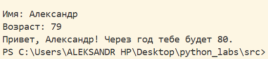
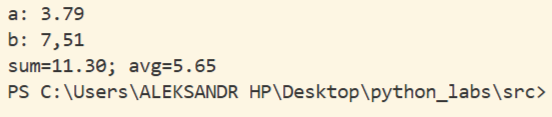
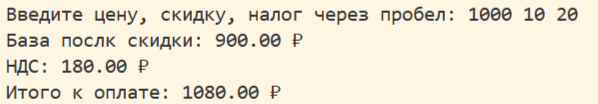
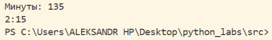
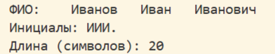
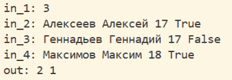
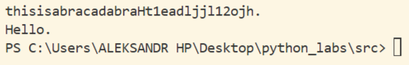

# Лабораторная работа №1

# Лабараторная работа №1
# Ввод, вывод, форматирование

## Задание 1
Вывод информации при помощи f-строки, приём разных типов данных.

## Задание 2
Обработка входных чисел, вывод среднего и суммы.

## Задание 3
Подсчёт итоговой суммы, НДС, и базы после скидки. Вывод с по строкам и с двумя знаками после запятой. 

## Задание 4
Перевод минут в формат часы:минуты.

## Задание 5
Поиск и вывод инициалов введённого ФИО, подсчёт символов ФИО с двумя пробелами.

## Задание 6
Обработка заданного n числа студентов, проверка на наличие True или False в данных, подсчёт каждого типа.

## Задание 7
Поиск изначального слова путём выполнения последовательных команд: 1. поиск первой заглавной буквы; 2. вычисление шага в заданной строке, с которым расположены символы изначального слова; 3. составление изначального слова. 
