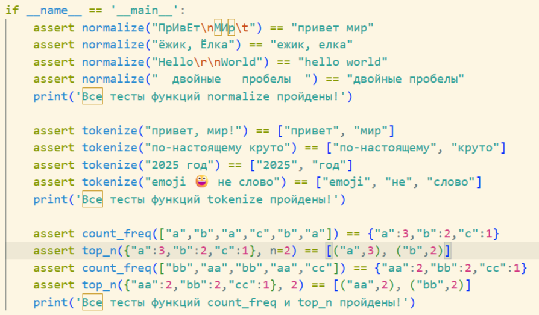
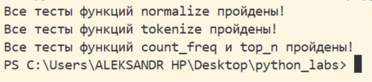
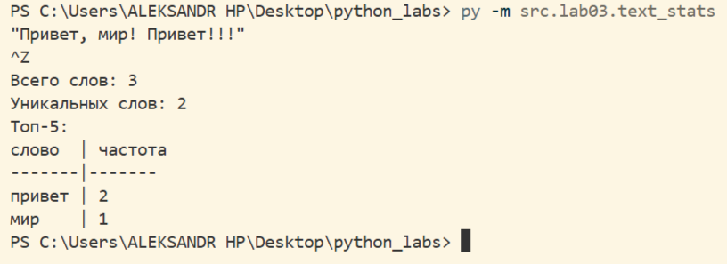
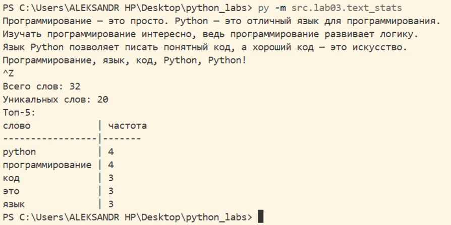

# Лабараторная работа №3

# Тексты и частоты слов (словарь/множество)

## Задание A
## Были реализованы четыре функции и помещены в папку lib для далнейшего использования:

### 1ая функция - normalize
Функционал - очистка строки от невидимых управляющих символов и замена их на пробелы, и конвертация повторяющихся пробелов в один. Привод строки к нормальному виду в нижнем регистре.

```python
def normalize(text: str, *, casefold: bool = True, yo2e: bool = True) -> str:
    '''
    Очистка строки text от невидимых управляющих символов (например, \t, \r), 
    замена их на пробелы, а также конвертация повторяющихся пробелов в один.

    Если параметр casefold=True — текст будет преобразован с помощью casefold. 
    Если параметр casefold=False - использование lower().

    Если параметр yo2e=True — заменить все ё/Ё на е/Е.
    '''
    words = text.split()
    new_text = ' '.join(words)

    if casefold == True: new_text = new_text.casefold()
    else: new_text = new_text.lower()

    if yo2e == True:
        new_text = new_text.replace('ё', 'е')
    return new_text
```

### 2ая функция - tokenize.
Функционал - разбиение строки на слова по небуквенно-цифровым разделителям
```python

def tokenize(text: str) -> list[str]:
    '''
    Разбиение строку text на "слова" по небуквенно-цифровым разделителям.
    Слова - последовательности символов (буквы/цифры/подчёркивание)
    + дефис внутри слова (например, по-настоящему),
    числа (например, 2025) считаем словами.
    '''
    from re import findall
    return findall(r'\w+(?:-\w+)*', text)
```

### 3ья функция - count_freq.
Функционал - подсчёт частот в формате слово → количество.

```python
def count_freq(tokens: list[str]) -> dict[str, int]:
    '''
    Подсчёт частот элементов из списка tokens в виде словаря слово → количество.
    '''
    unique_elements = sorted(list(set(tokens)))
    return {e: tokens.count(e) for e in unique_elements}
```

### 4ая функция - top_n
Функционал - поиск топ-n по убыванию частоты.

```python
def top_n(freq: dict[str, int], n: int = 5) -> list[tuple[str, int]]:
    '''
    Поиск топ-n по убыванию частоты в словаре freq.
    При равенстве частот — по алфавиту слова.
    '''
    freq_alph = sorted(list(freq.items()), key=lambda x: x[0])
    final_freq = sorted(freq_alph, key=lambda x: x[1], reverse=True)
    return final_freq[:n]
```

Общие тесты всех 4х функций:




## Задание B
## Был реализован скрипт text_stats
Ввод с помощью stdin. Обработка строки функциями из модуля text и вывод данных о количестве слов, количестве уникальных слов и топ-5 слов по частоте. Возможен вывод данных о топ-5 в виде таблицы

```python
import sys
import os

src_path = os.path.dirname(os.path.dirname(os.path.abspath(__file__)))
sys.path.insert(0, src_path)

from lib.text import *
text = sys.stdin.read()
if text.strip() == '':
    raise ValueError('Невозможно преобразовать пустую строку')

normalized_text = normalize(text)
words = tokenize(normalized_text)
unique_words = count_freq(words)
top_words = top_n(unique_words)
table_const = 1 # константа для вывода таблицей

print(f'Всего слов: {len(words)}')
print(f'Уникальных слов: {len(unique_words)}')
print('Топ-5:')

if table_const:
    max_len_word= max(len(w) for w, n in top_words)
    len_table = max(len('слово'), max_len_word)
    print(f'{'слово':<{len_table}} | частота')
    print(f'{'-' * len_table}-|-------')
    for w, n in top_words:
        print(f'{w:<{len_table}} | {n}')
```
## Тест по умолчанию:

## Тест №2:

## Запуск:
### Через Terminal (powershell):
1. Нужно прописать команду из корня репозитория: py -m src.lab03.text_stats
2. Затем ввести текст либо построчно, либо одной строкой
3. Завершение обработки текста (EOF):
- Windows / PowerShell: Ctrl+Z, затем Enter
- Linux / macOS: Ctrl+D
